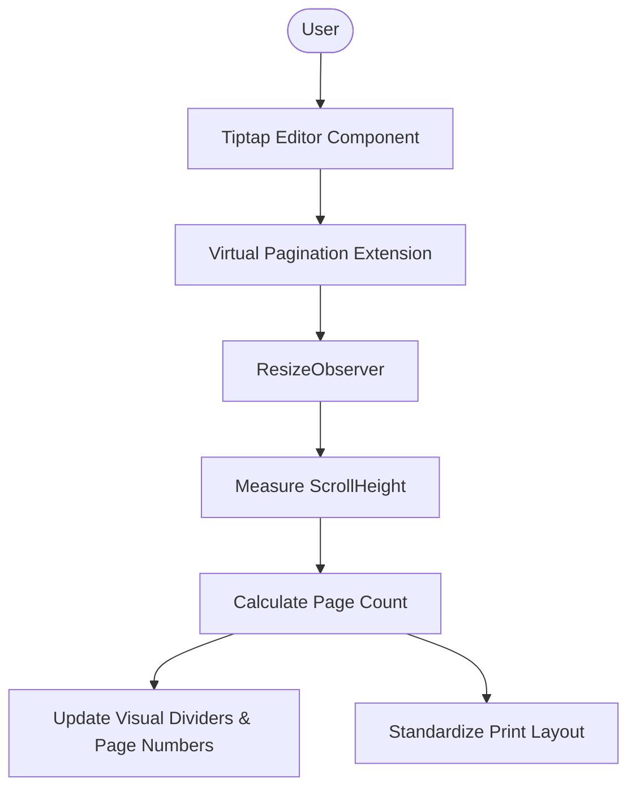
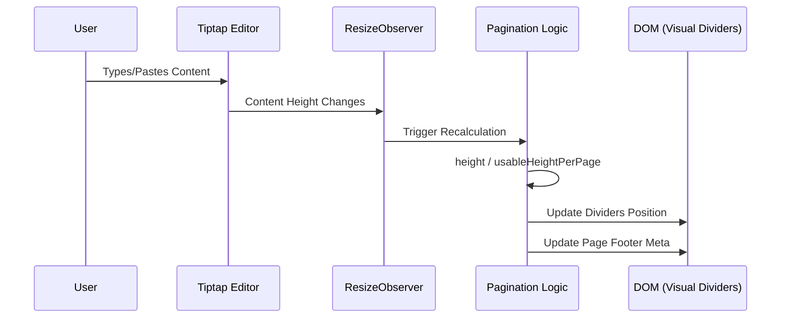

# OpenSphere Editorial - Tiptap Pagination Editor

A Tiptap editor with real-time "Virtual Pagination" designed for legal professionals.

## Approach: Virtual Slicing & Measurement
The core challenge of pagination in rich text editors is maintaining a single document state while providing physical page boundaries.

## Architecture & Logic

### High-Level Architecture

### Pagination Logic Flow

### How it works:
1. **Real-time Measurement**: We use a `ResizeObserver` on the editor content area to track visual height.
2. **US Letter Simulation**: The editor is constrained to an `8.5in` width. We calculate the required page count by dividing the total content height by the usable vertical space (`11in` minus margins).
3. **Ghost Dividers**: Visual "Page Break" markers are positioned at exact physical intervals (`11in`, `22in`, etc.). These markers are hidden during printing using `@media print`.
4. **Typography Fidelity**: We use `EB Garamond` (Serif) for the document content to match USCIS legal standards, ensuring that "What You See Is What You Get" (WYSIWYG) when printed.

### Trade-offs & Limitations:
- **Node Splitting**: Currently, we use a single continuous ProseMirror instance. While visual breaks appear, a single paragraph might still "span" across the visual gap. In a full production version, we would implement custom node views to force breaks between specific blocks.
- **Scroll Synchronization**: Large documents (50+ pages) might see a slight lag in indicator updates due to DOM measurement. This could be optimized with a dedicated `requestAnimationFrame` loop.

### Future Improvements:
- **Header/Footer Support**: Individual page headers for case numbers/petitioner names.
- **Node-aware Breaks**: Ensuring that headings never fall at the very bottom of a page (orphan/widow control).
- **Direct PDF Generation**: Integrating `jspdf` or `html2pdf.js` for one-click downloads without relying on browser print dialogs.

## Getting Started
1. Clone the repository.
2. Run `npm install`.
3. Start the development server with `npm run dev`.
4. Open `http://localhost:3000`.
